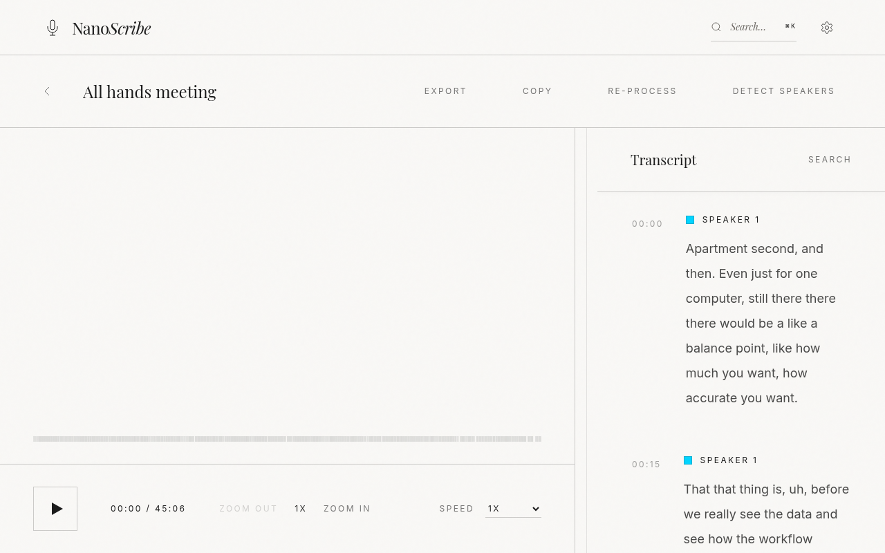
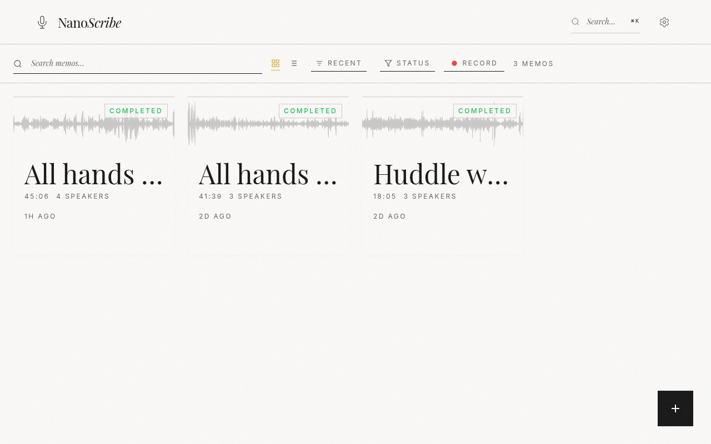
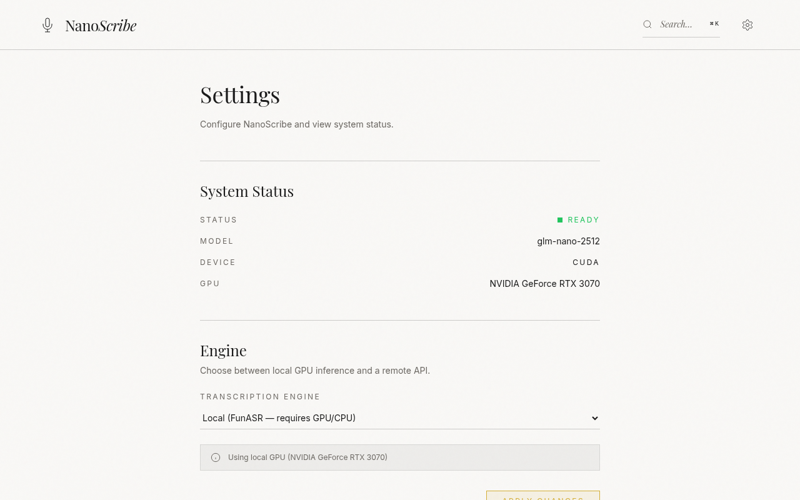
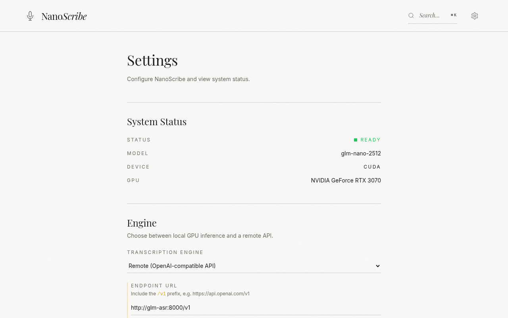

# NanoScribe

A polished local web app for [FunASR](https://github.com/modelscope/FunASR) voice memo transcription. Upload or record audio, watch progress in real time, edit transcripts, and export results — process locally on your GPU or via a remote OpenAI-compatible API.

<p align="center">
  
</p>

## Features

- **Upload & Record** — Drag-and-drop, batch upload, or in-app microphone recording
- **Real-time Progress** — SSE-based job progress with stage updates
- **Transcript Editor** — Editable segments with timestamps, click-to-seek, and autosave
- **Speaker Diarization** — Automatic speaker identification with color-coded badges and inline rename
- **Full-text Search** — Search across memo titles and transcript content
- **Export** — TXT, JSON, and SRT formats
- **Remote API** — Use any OpenAI-compatible API (OpenAI, Groq, etc.) instead of local GPU
- **OpenAI-Compatible Endpoint** — Drop-in `/v1/audio/transcriptions` for programmatic access
- **Offline Mode** — Works without internet once models are cached
- **PWA Installable** — Install as a desktop app with keyboard shortcuts

## Screenshots

<table>
  <tr>
    <td align="center"><b>Library</b></td>
    <td align="center"><b>Transcript Editor</b></td>
  </tr>
  <tr>
    <td></td>
    <td></td>
  </tr>
  <tr>
    <td align="center"><b>Settings — Local GPU</b></td>
    <td align="center"><b>Settings — Remote API</b></td>
  </tr>
  <tr>
    <td></td>
    <td></td>
  </tr>
</table>

## Requirements

- Docker & Docker Compose
- **Local inference:** NVIDIA GPU + [NVIDIA Container Toolkit](https://docs.nvidia.com/datacenter/cloud-native/container-toolkit/install-guide.html)
- **Remote inference:** Any OpenAI-compatible API endpoint (no GPU needed)

## Run it (no build required)

The fastest way to try NanoScribe is to pull the prebuilt image from GHCR:

```bash
mkdir -p data
docker run -d --name nanoscribe --gpus all \
  -p 8000:8000 -v "$(pwd)/data:/app/data" \
  --restart unless-stopped \
  ghcr.io/lsj5031/nanoscribe:latest
# open http://localhost:8000
```

Or with Docker Compose:

```bash
curl -O https://raw.githubusercontent.com/lsj5031/nanoscribe/main/compose.run.yml
docker compose -f compose.run.yml up -d
```

On first run the FunASR models (~2 GB) are downloaded into `./data/.modelscope_cache`.
Subsequent starts use the local cache.

## Build from source

```bash
# Clone the repository
git clone https://github.com/lsj5031/nanoscribe.git
cd nanoscribe

# Build the dev image (uses public nvidia/cuda base by default)
make build

# Start the dev server (http://localhost:8000)
make dev

# On first run, models will be downloaded from ModelScope (~2 GB).
# Subsequent starts use the local cache.
```

## Quick Reference

| Tag | Description |
|-----|-------------|
| `latest` | Latest development build |
| `v0.1.0` | First stable release (recommended) |

To use a specific version:
```bash
docker pull ghcr.io/lsj5031/nanoscribe:v0.1.0
```

## Make Commands

| Command | Description |
|---------|-------------|
| `make build` | Build the dev Docker image |
| `make build-prod` | Build the production image (with built SPA) |
| `make frontend-build` | Build the frontend SPA inside the container |
| `make dev` | Start dev environment with hot reload |
| `make shell` | Open an interactive shell in the container |
| `make check` | Run all quality checks (lint, format, typecheck, tests) |
| `make backend-check` | Run backend checks (ruff format, ruff check, ty check) |
| `make backend-test` | Run backend pytest suite inside Docker |
| `make frontend-check` | Run frontend checks (svelte-check, prettier) |
| `make test` | Run all tests (currently backend pytest) |
| `make hooks-install` | Install pre-commit hooks |
| `make smoke` | Verify FunASR and ModelScope imports |
| `make clean` | Remove built images and stop containers |

## Environment Variables

### Application Defaults

Defaults come from `backend/app/core/config.py`. The `docker-compose.yml` may override some values (e.g. `NANOSCRIBE_OFFLINE=1`).

| Variable | Default | Description |
|----------|---------|-------------|
| `NANOSCRIBE_DATA_DIR` | `/app/data` | Root directory for all persistent data |
| `NANOSCRIBE_STATIC_DIR` | `/app/static` | Path to built frontend SPA |
| `NANOSCRIBE_OFFLINE` | `0` | Set to `1` to skip remote model checks/downloads |
| `NANOSCRIBE_API_KEY` | _(empty)_ | Bearer token for the OpenAI-compatible endpoint |
| `NANOSCRIBE_REMOTE_ASR_URL` | _(empty)_ | Remote ASR endpoint URL (include `/v1` prefix) |
| `NANOSCRIBE_REMOTE_ASR_API_KEY` | _(empty)_ | API key for the remote ASR provider |
| `NANOSCRIBE_REMOTE_ASR_MODEL` | `whisper-1` | Model ID for the remote ASR provider |
| `NANOSCRIBE_REMOTE_ASR_TIMEOUT` | `900` | Remote ASR request timeout in seconds |
| `HF_HUB_OFFLINE` | `0` | Set to `1` to prevent HuggingFace downloads |
| `MODELSCOPE_CACHE` | `/app/data/.modelscope_cache` | ModelScope model cache directory |
| `PYTORCH_CUDA_ALLOC_CONF` | `expandable_segments:True` | CUDA memory allocator config |

### Offline Mode

If you've already downloaded models and want to run without internet:

```yaml
# In docker-compose.yml, set:
environment:
  - HF_HUB_OFFLINE=1
  - NANOSCRIBE_OFFLINE=1
```

This prevents FunASR from checking for model updates and 3D-Speaker from attempting downloads. Fresh deployments should keep these at `0` until models are cached.

## Project Structure

```
frontend/               # SvelteKit SPA
  src/
    lib/
      components/       # Svelte UI components
      stores/           # Svelte reactive stores
    routes/             # SvelteKit routes
  package.json
  pnpm-lock.yaml

backend/                # FastAPI backend
  app/
    api/                # REST API endpoints
    core/               # Config and dependencies
    db/                 # SQLite migrations and helpers
    schemas/            # Pydantic request/response models
    services/           # Business logic services
  tests/                # pytest test suite
  pyproject.toml

data/                   # Persistent storage (bind-mounted)
  nanoscribe.db         # SQLite database
  .modelscope_cache/    # Downloaded models
  memos/                # Audio and transcript files

Dockerfile              # Multi-stage build (dev + production)
docker-compose.yml      # Dev environment configuration
Makefile                # Development commands
```

## Storage Layout

```
/app/data/
  nanoscribe.db
  memos/
    <memo_id>/
      source.original       # Uploaded audio (original format)
      normalized.wav        # ffmpeg-normalized 16kHz mono WAV
      waveform.json         # Waveform peak data for visualization
      transcript.raw.json   # Raw FunASR output
      transcript.final.json # Editor-ready segment data
      exports/              # Generated exports (txt, json, srt)
```

## Models

NanoScribe uses these FunASR models (auto-downloaded on first run):

| Model | ID | Purpose |
|-------|----|---------|
| Fun-ASR-Nano-2512 | `FunAudioLLM/Fun-ASR-Nano-2512` | Speech recognition with timestamps |
| fsmn-vad | `iic/speech_fsmn_vad_zh-cn-16k-common-pytorch` | Voice activity detection |
| ct-punc | `iic/punc_ct-transformer_cn-en-common-vocab471067-large` | Punctuation restoration |
| CAM++ | `iic/speech_campplus_sv_zh_en_16k-common_advanced` | Speaker diarization |

Models are stored in `data/.modelscope_cache/` and loaded ephemerally onto the GPU during inference to conserve VRAM.

## API Overview

| Endpoint | Method | Description |
|----------|--------|-------------|
| `/api/system/health` | GET | Component health status |
| `/api/system/capabilities` | GET | Runtime capability manifest |
| `/api/system/readiness` | GET | Per-model readiness status |
| `/api/system/status` | GET | System status and storage info |
| `/api/system/settings/engine` | GET | Current engine configuration |
| `/api/system/settings/engine` | PUT | Update engine configuration |
| `/api/memos` | GET/POST | List or upload memos |
| `/api/memos/{id}` | GET/DELETE | Get or delete a memo |
| `/api/memos/{id}/audio` | GET | Stream audio file |
| `/api/memos/{id}/waveform` | GET | Waveform peak data |
| `/api/memos/{id}/segments` | GET/PATCH | Get or edit transcript segments |
| `/api/memos/{id}/speakers` | GET/PATCH | Get or rename speakers |
| `/api/memos/{id}/reprocess` | POST | Re-run transcription |
| `/api/memos/{id}/regenerate-diarization` | POST | Re-run diarization only |
| `/api/memos/{id}/retry` | POST | Retry last failed job |
| `/api/memos/{id}/jobs` | GET | List jobs for a memo |
| `/api/memos/{id}/export` | GET | Export (txt/json/srt) |
| `/api/jobs/{id}` | GET | Job status |
| `/api/jobs/{id}/events` | GET | SSE event stream |
| `/api/jobs/{id}/cancel` | POST | Cancel a running job |
| `/api/search` | GET | Search memos and transcripts |
| `/v1/audio/transcriptions` | POST | OpenAI-compatible transcription |
| `/v1/models` | GET | OpenAI-compatible model list |

## Development

### Backend

```bash
# Run inside the container
make shell

# Then inside the container:
cd /app/backend
ruff format .          # Auto-format
ruff check .           # Lint
ty check .             # Type check
python -m pytest       # Run tests
```

### Frontend

```bash
# Run inside the container
make shell

# Then inside the container:
cd /app/frontend
pnpm dev               # Dev server with HMR
pnpm check             # Svelte type checking
pnpm format:check      # Prettier format check
pnpm build             # Production build
```

### Testing

```bash
# Full backend test suite (preferred entry point)
make backend-test

# Or run pytest directly inside the container for fine-grained control
docker compose exec funasr bash -c "cd /app/backend && pytest -v"
docker compose exec funasr bash -c "cd /app/backend && pytest tests/test_transcription.py -v"
```

`make check` runs lint + type checks + the full pytest suite, mirroring the
[CI workflow](.github/workflows/check.yml).

## Specification

See [SPEC.md](SPEC.md) for the full product and engineering specification.
